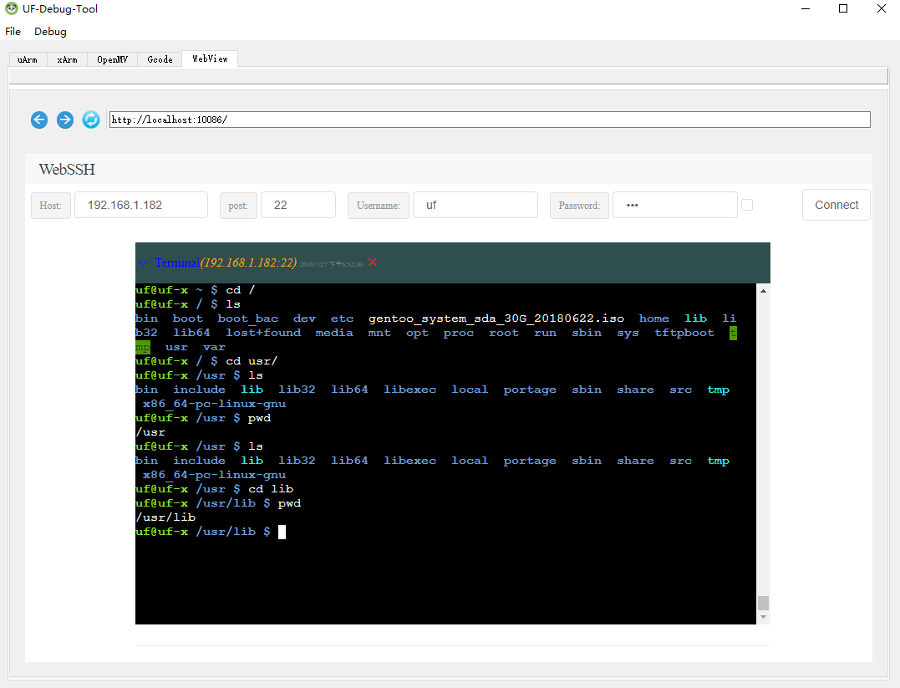

# UF-Debug-Tool
---
> 一个UFACTORY系列机械臂的调试工具

## 功能
- uArm调试工具
- xArm调试工具
- OpenMV简易IDE工具
- Gcode生成工具
- 在线SSH工具
- 内嵌浏览器

## 环境与依赖
- Python3.5
- PyQt5
- Tornado
- [uArm-Python-SDK](https://github.com/vimior/uArm-Python-SDK)
- [xArm-Python-SDK](https://github.com/vimior/xArm-Python-SDK)

## 功能展示
### uArm调试工具
- 坐标控制（包括极坐标）
- 电机控制
- 状态信息获取与设置
- 夹子吸泵控制

### xArm调试工具
- 状态信息获取与设置
- 笛卡尔控制
- 关节控制
- 电机参数设置

### OpenMV简易IDE
- 代码窗口
- 运行控制机输出
- 摄像头数据获取与控制

### Gcode生成器（svg转gcode）
- 支持激光模式和画笔模式的Gcode生成（轮廓）
- 实时通过参数调整Gcode,包括起点和终点，速度，偏移，抬笔高度、放大缩小

### 在线SSH工具
- 支持连接信息设置
-最多同时支持5个连接终端
- 支持终端的折叠与关闭

### 内嵌浏览器
- 支持地址输入
- 支持前进、后退、停止、刷新

### 日志窗口（从菜单栏打开）
- 支持调试信息输入（机械臂控制与状态）
- 支持OpenMV代码运行的输出
- 支持日志清除

