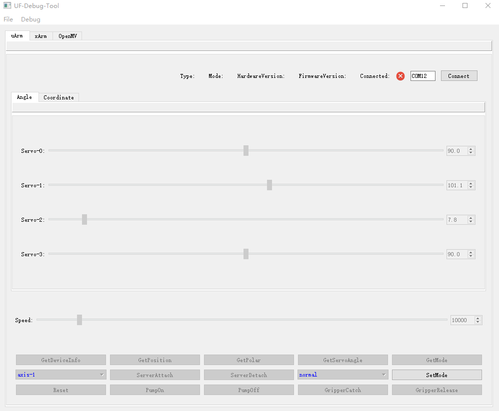
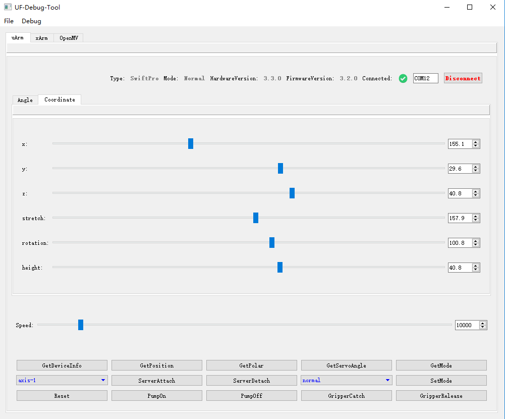
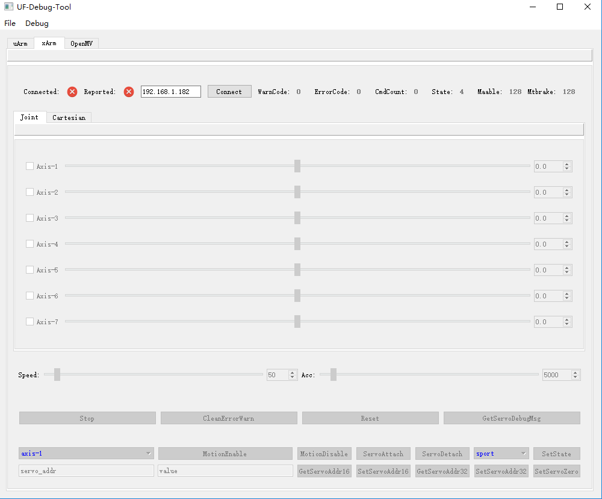
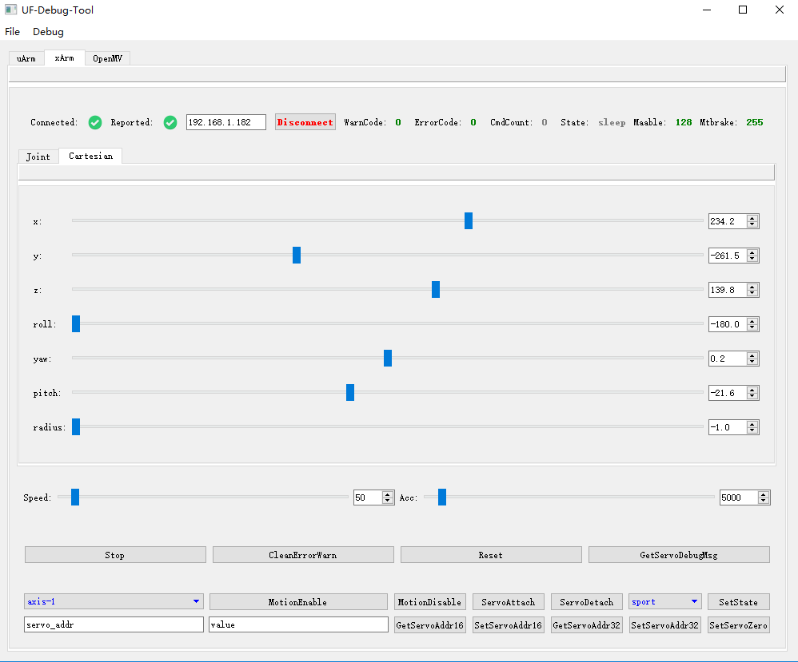
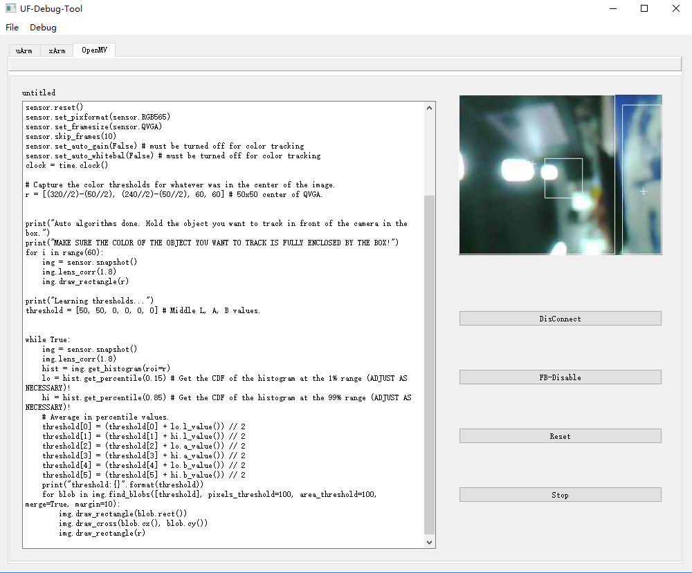
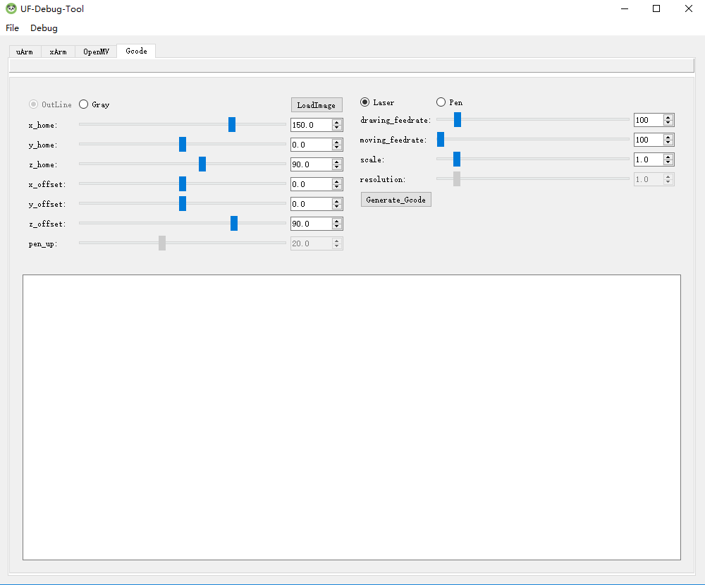
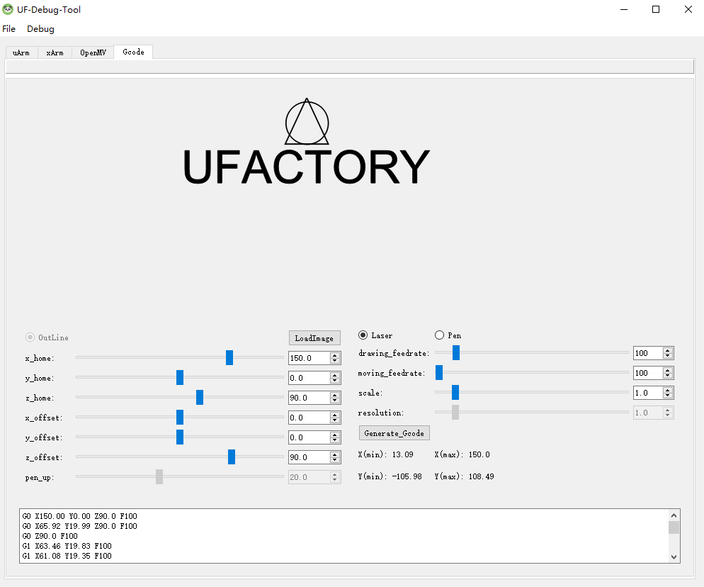
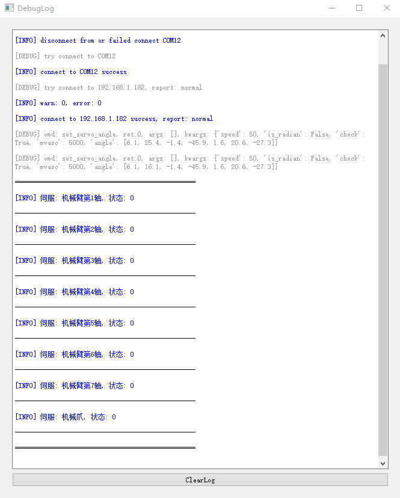

# UF-Debug-Tool
---
> 一个UFACTORY系列机械臂的调试工具
> 支持uArm/xArm/OpenMV
> 需要安装[uArm-Python-SDK](https://github.com/vimior/uArm-Python-SDK)
> 需要安装[xArm-Python-SDK](https://github.com/vimior/xArm-Python-SDK)

## 概述
基于PyQt5实现的一个界面调试工具，可以方便地控制机械臂。

### 技术栈
- Python3
- PyQt5

### 展示
uArm：

xArm:

OpenMV:

Gcode:

Log:

